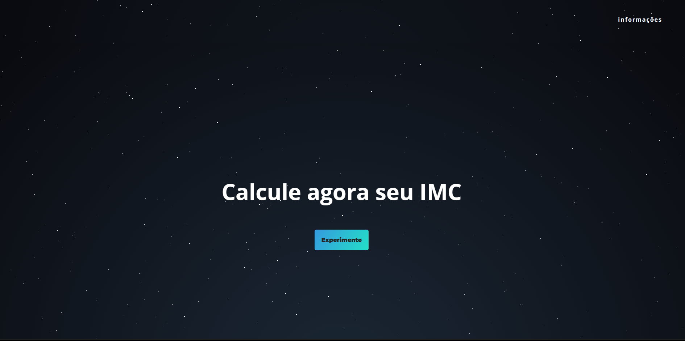
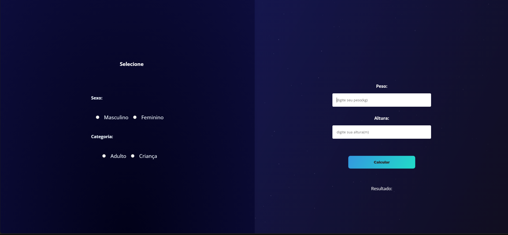
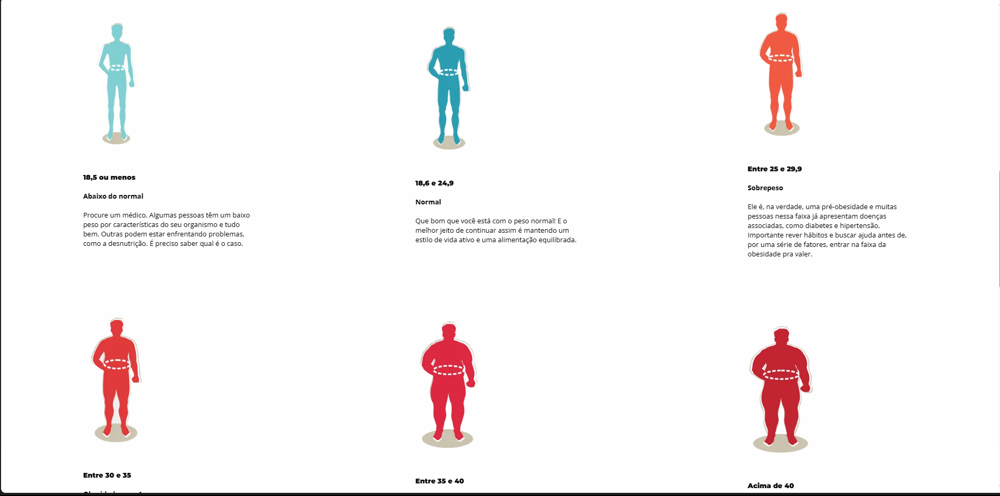

---

# BMI Calculator (Body Mass Index)

## VERSION 1.5 -WITH HTML & CSS & JS

Welcome to my BMI Calculator, a tool I developed on my own to help you monitor and understand your body health. The Body Mass Index is a simple yet effective measure that assesses the relationship between your weight and height, providing insights into your nutritional status.

## How to Use

1. Enter your weight in kilograms.
2. Enter your height in meters.
3. Click the "Calculate BMI" button.

## LINK WEBSITE:
* ONLY DESKTOP VERSION 
 

* [BMI-CALCULATOR](https://imc-calculadora-devpedrorosa.netlify.app/)

 
  
  

The calculator will instantly provide your BMI and a corresponding classification, indicating whether you fall within the healthy range, underweight, overweight, or obese.

## Why It's Important

BMI is a valuable tool for assessing body composition and identifying potential health risks. Understanding your BMI can help set realistic goals to achieve or maintain a healthy weight.

## PHOTOS

<table>
  <tr>
    <td></td>
    <td></td>
    <td></td>
  </tr>
</table>

## Development

This BMI Calculator was entirely developed by me, without external assistance. I used [ HTML, CSS, JavaScript]. Feel free to contribute, report issues, or suggest improvements. I am open to collaborations!

Thank you for using my BMI Calculator. Take care of your health and use this tool as a resource to promote a healthy lifestyle.

---
